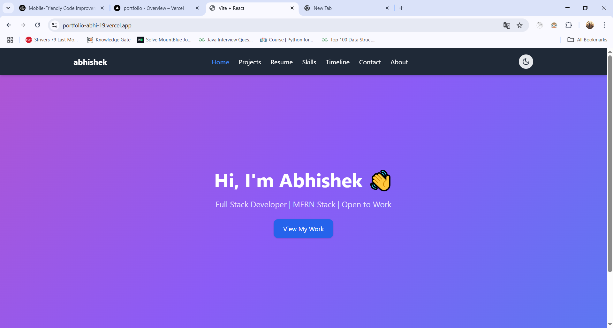
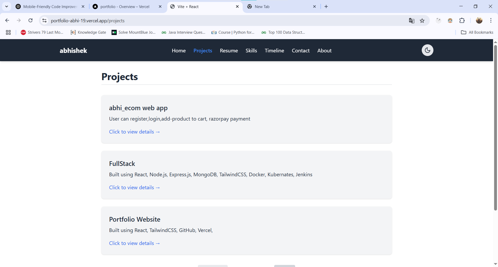
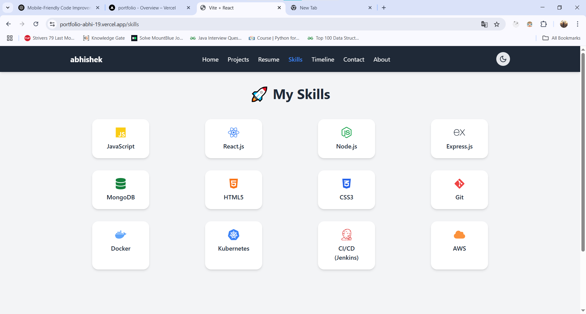
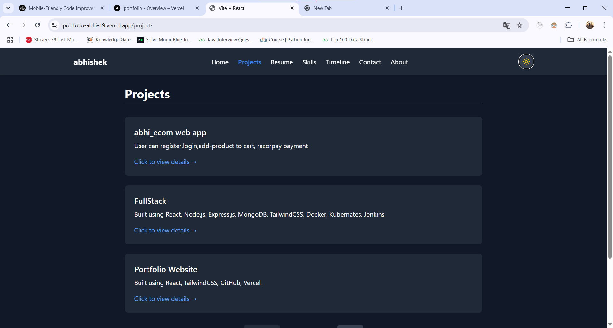

# 🧑‍💻 Abhishek Kumar - Developer Portfolio

Welcome to my developer portfolio! I'm **Abhishek Kumar**, a passionate Full Stack Developer specializing in the **MERN Stack** (MongoDB, Express.js, React.js, Node.js), with a strong interest in building responsive, scalable, and user-friendly web applications.

This portfolio showcases my **projects, skills, resume**, and my journey in web development.

---

## 🚀 Tech Stack

- **Frontend:** React.js (Vite), Tailwind CSS, JavaScript
- **Backend:** Node.js, Express.js
- **Database:** MongoDB
- **DevOps / Tools:** Git, GitHub, Docker, Kubernetes, CI/CD
- **Cloud:** AWS
- **Other Skills:** Data Structures & Algorithms, Agile Methodologies

---

## 📂 Folder Structure

portfolio/ │ ├── public/ # Static assets ├── src/ # Main source code │ ├── assets/ # Images, icons, etc. │ ├── components/ # Reusable UI components │ ├── pages/ # Route-based pages │ └── App.jsx # Root component │ ├── index.html # HTML template ├── package.json # Project metadata & scripts └── tailwind.config.js # TailwindCSS configuration


---

## 📸 Features

- Fully responsive and modern UI
- Project showcase with detailed modals
- Dark/light mode toggle
- Smooth animations with Framer Motion
- Resume download functionality
- Contact form with email integration (if available)

---

## 🌐 Live Demo

👉 [Click here to view live demo](https://portfolio-abhi-19.vercel.app/)

---


## 📸 Screenshots

> - Home Page  


> - Projects  


> - Resume


> - Skills  


> - About  


> - Dark Mode  


---


## 🛠️ Installation

```bash
# Clone the repository
git clone https://github.com/your-username/DPortfolio.git

# Navigate to the project folder
cd DPortfolio/portfolio

# Install dependencies
npm install

# Start the development server
npm run dev


## 🧑‍💼 Author

**Abhishek Kumar**

🔗 [Connect with me on LinkedIn](https://www.linkedin.com/in/abhishek-kumar193/)